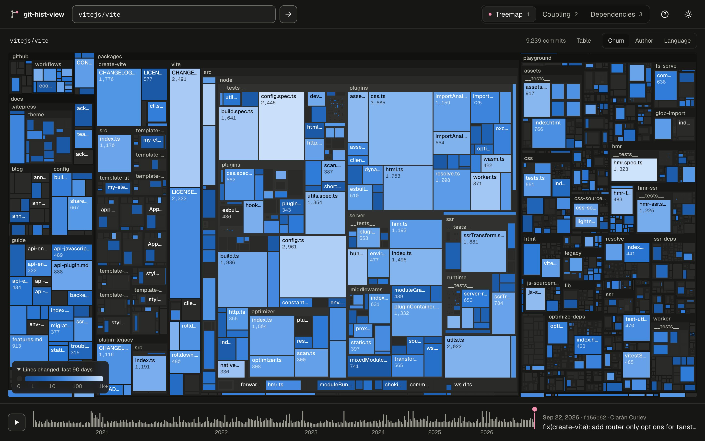
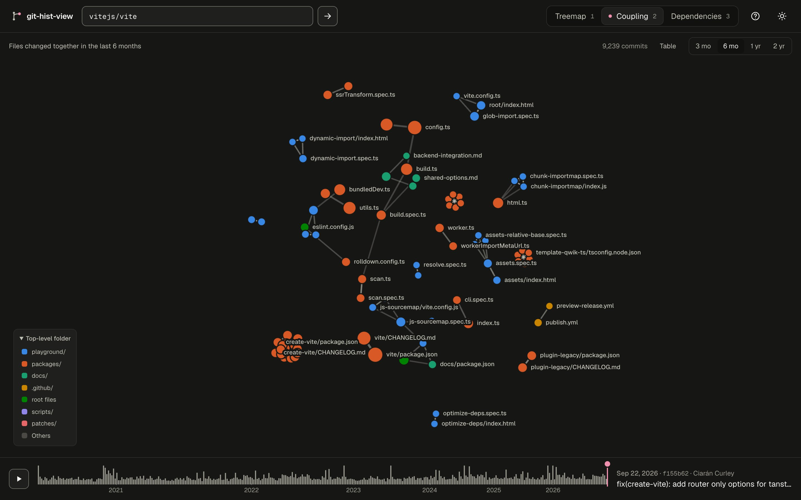
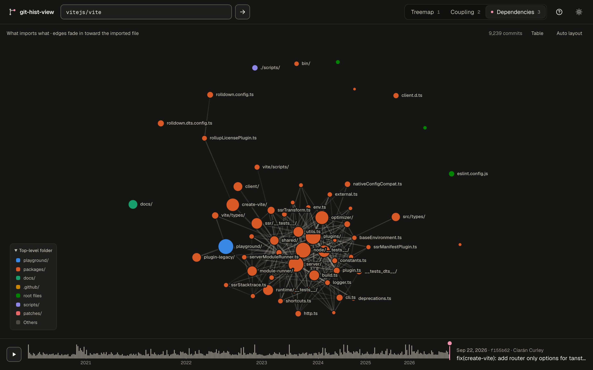
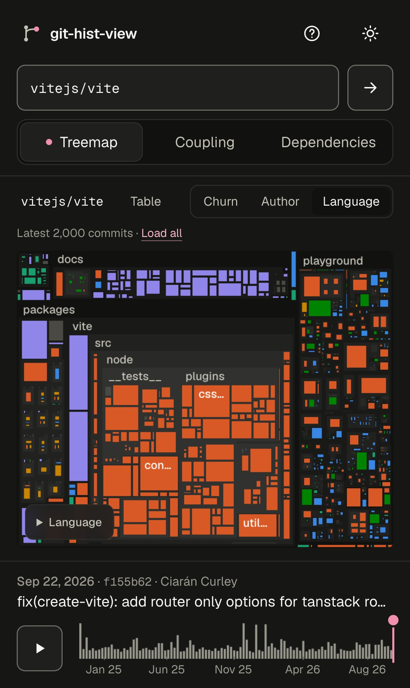
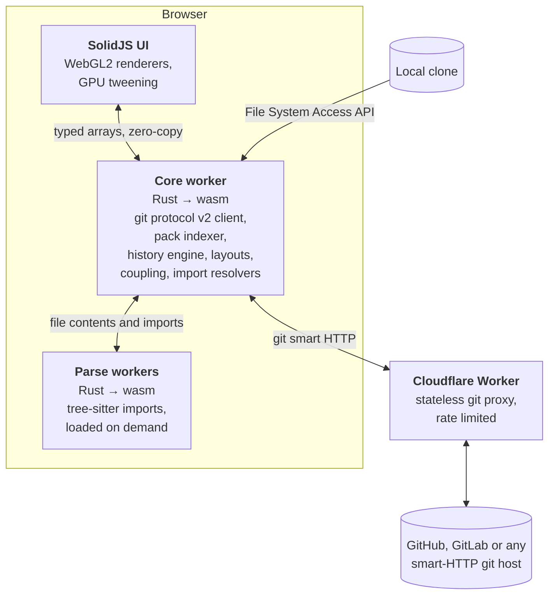

# git-hist-view

Replay any git repository's history. Paste a link to a public repository or open a local clone, and git-hist-view animates three views commit by commit: a treemap of the code, a graph of files that change together, and a graph of what imports what. A Rust engine compiled to WebAssembly does all the work in your browser.



| Co-change coupling | Dependencies |
| --- | --- |
|  |  |

## What you can see

The treemap sizes every file by lines of code. You can color it by recent churn (lines changed in the last 90 days), by the author who owns the most surviving lines, or by language. Press play and files appear, grow, shrink and move as folders get reorganised. Click into folders, and hover or tap a file for details.

The coupling graph links files that keep changing together within a sliding window of 3 months to 2 years. Thicker edges mean more shared commits. More opaque edges mean the pair rarely changes apart (Jaccard similarity). Bot commits, dependency bumps and mass reformatting are ignored, which leaves the coupling that comes from the design. Select a file to list its partners.

The dependency graph resolves imports with tree-sitter for TypeScript/JavaScript, Rust and Python. It starts as a folder graph that is already opened up where the code is dense. You can open any folder and see what each file imports and what imports it.

One timeline drives all three views. It shows a churn sparkline above the track, and you can play it back or step through it from the keyboard. Every position has a shareable link that reopens the same repository, view, folder and commit.



## Keyboard

| Keys | Action |
| --- | --- |
| `1` `2` `3` | Treemap, coupling, dependencies |
| `Space` | Play or pause |
| `←` `→` (`Shift` for ×10), `Home`, `End` | Step through history |
| Arrows, `Enter`, `Esc` (view focused) | Move between cells or nodes, open, go back |
| `C` | Cycle treemap colors |
| `/` | Focus the repository box |
| `⌘K` / `Ctrl K` | Command palette |
| `T` | Light or dark theme |
| `?` | All shortcuts |

The Table button shows any view as a data table, and screen readers announce the focused item.

## How it works



The engine speaks git protocol v2 itself, calling `ls-refs` and then a shallow `fetch` with a blob size filter. It indexes the downloaded pack (delta resolution and SHA-1, checked against git's own `.idx` files) and walks first-parent history. Local folders are read directly through the File System Access API.

History is processed in one pass. Each commit's tree is diffed against its parent's, skipping identical subtrees, and each changed file is line-hashed once and diffed with the histogram algorithm. The result is an event log per file, so lines, churn and owner at any commit take a binary search. Renames are paired the way git pairs them, by similar paths first and then by files sharing at least 50% of their lines.

For animation, up to 300 keyframes are spread across history. Rust lays out the segment between two keyframes and the GPU interpolates it, so each frame costs one draw call per layer. Graph layouts start from the previous keyframe's positions, which keeps nodes near where you last saw them.

Imports are parsed once per unique file version, in a pool of workers, and resolved the way each toolchain would. The TS/JS resolver follows tsconfig `paths` and `extends`, workspace packages and `.js`→`.ts` rewrites. Rust imports go through crate roots, module trees, `#[path]`, `super`/`self` and sibling crates, and Python imports through packages, `src/` layouts and relative levels.

### Measured

These numbers come from an Apple M4 Pro (14 cores, 48 GB) on macOS 26. Browser times are from Chrome on a 120 Hz display and include downloading the repository through the proxy, so your connection affects them.

| | native | in the browser |
| --- | --- | --- |
| ripgrep, full history (2,215 commits) | 0.16 s | 1.0 s including download |
| vite, 9,239 commits | 0.79 s | 4.6 s including download |
| vite imports: 1,434 files parsed and resolved | 0.2 s | +1.7 s |
| Playback, treemap or graph, vite | | 120 fps, no long tasks |

Until the dependency view first opens, the app is about 220 KB compressed. The tree-sitter module (495 KB) loads only for that view.

### Checked against git

Golden tests compare the engine with the git CLI. They run on a synthetic repository (merges, renames, symlinks, submodules, CRLF, binaries, bots, version bumps) and on real clones of hexyl, ripgrep, flask and vite.

- First-parent walks and every per-commit file change match `git rev-list` and `git diff-tree` exactly.
- Lines of code at HEAD match exactly.
- Per-file churn matches `git log --numstat` for at least 99.5% of file changes, and total churn is within 0.1%. The small gap comes from hunks that two histogram implementations split differently.
- Line ownership agrees with `git blame --first-parent` on 99.2% to 100% of lines per repository. The exception is vite at 96.6%, where many identical files were moved at once and blame pairs some of them with a different copy.

## Development

You need Rust with the `wasm32-unknown-unknown` target and the `llvm-tools` component (for `llvm-ar`), `wasm-bindgen-cli` 0.2.127, `wasm-opt` from binaryen, and [Bun](https://bun.sh) 1.3 or later.

```sh
rustup target add wasm32-unknown-unknown && rustup component add llvm-tools
cargo install wasm-bindgen-cli --version 0.2.127
bun install
bun run wasm          # builds both wasm modules into web/src/wasm
bun run proxy         # git proxy on :8787 (terminal 1)
bun run dev           # app on :5173, proxying /git to :8787 (terminal 2)
```

```sh
bun run lint                                                                          # Biome, rustfmt and clippy
bun run format                                                                        # apply Biome and rustfmt fixes
cargo test --workspace --exclude ghv-wasm-core --exclude ghv-wasm-parse --release     # unit and golden tests
bunx playwright install chromium webkit firefox && bun run test:e2e                   # browser tests
./target/release/ghv stats|treemap|coupling|deps <path-to-repo>                       # native benchmarks
bun run screenshots                                                                   # regenerate these screenshots
```

The golden tests build their fixture with `fixtures/make-repos.sh` and also pick up bare clones in `fixtures/repos/`, for example `git clone --bare https://github.com/BurntSushi/ripgrep fixtures/repos/ripgrep.git`. The browser tests serve the fixture through a local `git upload-pack`, so they work offline.

`bun run deploy` builds the app and deploys the site and the proxy together as one Cloudflare Worker with static assets (`proxy/wrangler.jsonc`).

### Layout

```
crates/core        git layer, history engine, layouts, views, import resolution (native-testable)
crates/parse       tree-sitter import extraction
crates/wasm-core   wasm facade for the core worker
crates/wasm-parse  wasm facade for the parse workers
crates/cli         native harness and golden tests
web/               SolidJS app, workers, WebGL2 renderers
proxy/             Cloudflare Worker: git proxy and static assets
```

## Privacy and limits

Your browser does all the analysis. The proxy only relays git's two smart-HTTP endpoints, stores nothing and refuses private addresses. Remote fetching works for public repositories only, so open a local clone for anything private. Remote downloads stop at 512 MB. The latest 10,000 commits are analyzed by default (2,000 on phones), and "Load all" raises the limit to 200,000.

## License

[MIT](LICENSE)
